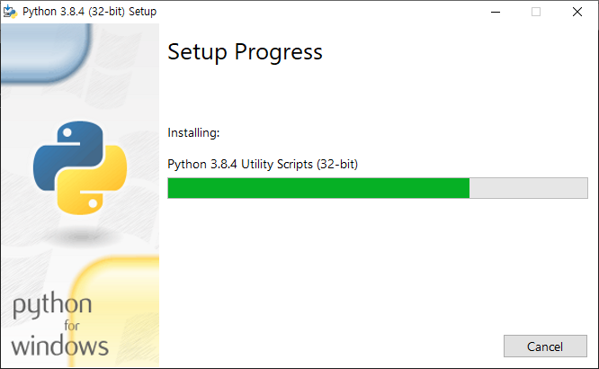
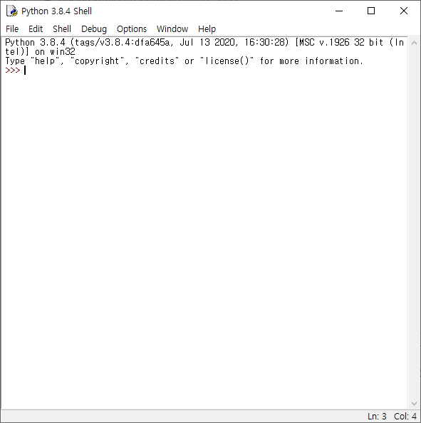

# 파이썬 강좌- 02
## 윈도우 파이썬 다운로드
1. 먼저 [파이썬 홈페이지](https://www.python.org/downloads/)로 접속합니다
     

2. 파이썬 홈페이지에서 파이썬을 다운받습니다. 파이썬은 시간이 지나면 버전이 업데이트 되는데 3으로 시작하는 버전을 다운로드 받아 주시길 바랍니다.

3. 파이썬을 설치합니다. 아래에 있는 Add Python 3.x.x to Path 라고 쓰인 부분을 체크하면 명령 프롬프트 어디서나 파이썬을 실행할 수 있습니다.

     

4. 하고 나면 파이썬이 다운로드를 시작합니다.
     

5. 다운로드가 완료되었습니다.

     
     

6. 그러면 이제 정상적 다운로드가 완료되었는지 확인해보도록 합시다. 윈도우 버튼을 눌러 Python 3.x > IDLE(Python 3.x 32bit)을(를) 켜주세요.

     
